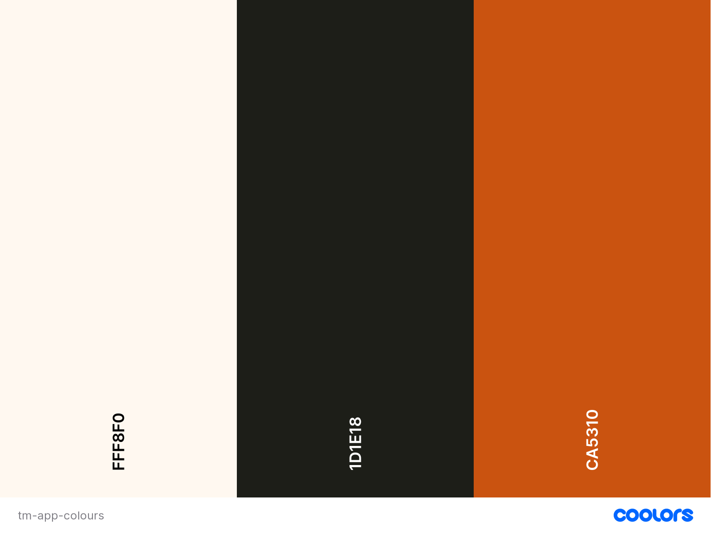

# Task Management App

Welcome to the Zentro Task Management App documentation! This document serves as a comprehensive guide to understanding and utilizing the task management system developed specifically for Zentro, a fictional web design company. The Zentro Task Management App is designed to streamline task creation, management, and collaboration within the organization, ultimately enhancing productivity and efficiency.

[View Task Managment App on Heroku](https://tm-app-project-526d2d49fda5.herokuapp.com/)

## User experience 

**Scope Overview**

The Zentro Task Management App project encompasses the design, development, and deployment of a web-based application specifically tailored to meet the task management needs of Zentro. The app will enable Zentro employees to:

* Create Tasks: Users can create new tasks, specifying details such as description, due date, priority level, and assignment to specific teams or individuals.
* Manage Tasks: Users can view, edit, and update task details, track task progress, and mark tasks as complete when finished.
* Collaborate: The app will facilitate collaboration among team members by providing tools for task assignment, communication, and sharing of project-related updates and documents.

**Key Features**

The Zentro Task Management App will include the following key features:

* User Authentication: Secure login and registration system to authenticate users and ensure data privacy.
* Task Creation and Management: Intuitive interface for creating, editing, and managing tasks with ease.
* Team Collaboration: Tools for assigning tasks to teams or individuals, sharing updates, and fostering collaboration.
* Task Prioritization: Options to set task priorities and deadlines to help users manage their workload effectively.
* Reporting and Analytics: Insights and analytics tools to track task performance, identify trends, and make data-driven decisions.

**Target Audience**

The primary users of the Zentro Task Management App will be employees of Zentro, including project managers, designers, developers, and other team members involved in project execution and coordination.

**User Stories**

* As a designer, I want to be able to log in to my account using my credentials, so that I can access project tasks and collaborate with my team.
* As a designer, I want to be able to view a list of tasks assigned to me, categorized by project or client, so that I can prioritize my design work accordingly. 
* As a designer, I want to be able to create new design tasks, providing details such as project/client name, project description, deadline, priority and responsibility so that I can manage my design workload effectively.
* As a manager, I want to be able to view a dashboard showing all tasks assigned to my team, categorized by project or priority, so that I can monitor team workload and allocate resources effectively.
* As a manager, I want to be able to view the profiles of team members, including their contact information, role, and assigned tasks, so that I can communicate effectively and provide support as needed.
* As a developer, I want to be able to update task statuses, such as "In Progress" or "Completed," so that I can track my progress and communicate with team members effectively.

**Project Deliverables**

The project will deliver a fully functional web-based task management application, including:

* Frontend interface for user interaction and task management.
* Backend server-side logic for handling user authentication, task creation, management, and collaboration.
* Integration with a database (e.g., MongoDB) to store user data, task details, and other relevant information.
* Deployment to a web server or cloud platform for production use.

---

## Design

**Colour Scheme**

Colours selected on coolors website.

**Typography**

Google Fonts was used for the following font with different font weight:

* Urbanist sans-serif is used on the whole website.
[Google fonts](https://fonts.google.com/specimen/Urbanist)

**Imagery**

All media content was hold all rights reserved, as developer creation (own by Julia Lavagnini)

**Wireframes**

**Accessibility**

* Responsive design ensures that our app adapts seamlessly to different screen sizes and devices, providing a consistent user experience.
* The app prioritizes a clear and intuitive layout to ensure ease of navigation for all users.
* Carefully selection of colours with high contrast to improve readability and usability.

---

## Technologies

- `Styled Components` 
- `Flask`
- `MongoDB`
- `Python`
- `JavaScript`

**Frameworks, Libraries & Programs Used**

- Figma - Used to create wireframes.
- Git - For version control.
- Github - To save and store the files for the website.
- Materialize CSS - The framework for the website. Code for the navigation bar, grid, and essential elements were used and modified. Additional CSS styling was also implemented in style.css.
- Google Fonts - To import the fonts used on the website.
- Font Awesome - For the simple iconography on the navbar.

**Progress**

I used the project walkthrough template task manager and adapt to my requirements. The user profile has all neccessary action to makes functional and organised to use. 

The challenges I enconter in this project was all related to the IDLE I used to work because I found much more difficult to work with platform as VS so I used Codeanywhere, it cause a few proplems. 

On MongoDB I create different field to address each category correctly. As team is stored on its id form put be easy to cath all users with the same id and only one team name is stored on duplication. I also use JavaScript to display the current date.

**What can be improved?**

In the future, features as adding files and media would benefit the users to a better workflow. Also, when creating tasks the users could specify the project/client would be more efficient. Finaly, Team leads having access to its team tasks is good to meet and communication between them. 

---

## Deployment 

To make the deployment Heroku hosting was used. First set a Procfile to specify the commands on how start and run the application. 

Finally, on Heroku website, create new app, select the GitHub repository as Deployment method, go to settings and config the vars, go back to deploy section and select 'Enable Automatic Deploys' then create the app.

* To Folk this repository, click on the Folk button in the top right corner. 

* To clone, click to 'Code' green button (top right corner) and select whether you would like to clone with HTTPS, SSH or GitHub CLI and copy the link shown. Open the terminal in your code editor and change the current working directory to the location you want to use for the cloned directory. Type 'git clone' into the terminal and then paste the link you copied.

---

## Credits

The template I took from the Code Institute walkthrought project 3 and make some changes. I also use their user authentication specially to validate the forms.

My home.html these lines {{ tasks|selectattr('task_name')|list|length }} and {{ tasks|selectattr('priority','equalto','High')|list|length }} where I took the reference from a [Stackoverflow page](https://stackoverflow.com/questions/40006617/get-count-of-list-items-that-meet-a-condition-with-jinja2). It simple calculate the number of tasks by counting how many of them have a non-empty 'task-name' attribute and the other calculates the number with a priority equal to 'High'.

I also use components of Materialise CSS as the forms, search engine and buttons but gave modifications to suit th project needs. 