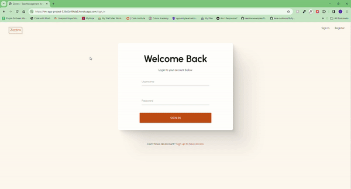
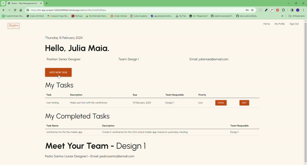
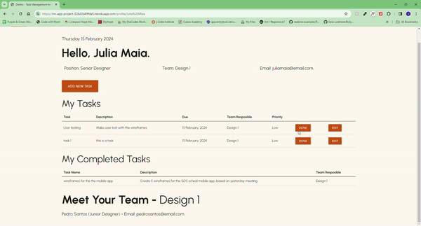

# Testing

## Manual Testing

### Device and Browser Testing

|**Testing**|**iPhone 12 safari**|**iPad Air 10.2" safari**|**HP Pavillion OS Edge**|**HP Pavillion OS Chrome**|**Chrome Developer Tools**|
|-----|-----|-----|-----|-----|-----|
|Responsive|Yes|Yes|Yes|Yes|Yes|
|Navbar working properly|Yes|Yes|Yes|Yes|Yes|
|Search feature is functionally and its buttons work|Yes|Yes|Yes|Yes|Yes|
|highlight icon on home page count as asked|Yes|Yes|Yes|Yes|Yes|
|Forms having the corrent validating|Yes|Yes|Yes|Yes|Yes|
|Logout message appear at the correct space|Yes|Yes|Yes|Yes|Yes|
|User information displays|Yes|Yes|Yes|Yes|Yes|
|Members in the same team display on user profile|Yes|Yes|Yes|Yes|Yes|

### Manual Testing of User Actions

|**Feature**     |**Action**     |**Expected Behaviour**     |**Result**     |
|----------------|---------------|---------------------------|---------------|
|Search|type any data|seach on upgoing tasks and complete tasks table|Pass|
|Navbar|different navbar items |when user sign in the navbar change it items to allow easy access|Pass|
|Register|validation|Fill out all neccessary fields and following the requirements as lenght and special character on email|Pass|
|Login|enter user data|username only accept two names separated by space as 'FN LN'|Pass|
|Tasks button|click 'Done' button|Move the task to the completed tasks table|Pass|
|Add Task|Fill the form|Enter all details in the form|Pass|

### Testing User Stories

|**User Story**|**Outcome**|**Screengrabs**|
|-----|-----|-----|
|I want to be able to log in to my account using my credentials, so that I can access project tasks and collaborate with my team.|User able to login, access its own account, add, edit, view and mark as done the tasks ||
|I want to be able to create new design tasks, providing details such as project/client name, project description, deadline, priority and responsibility so that I can manage my design workload effectively.|User able to add and edit tasks deatils||
|I want to be able to view a dashboard showing all tasks assigned to my team, categorized by project or priority, so that I can monitor team workload and allocate resources effectively.|All tasks displayed of main page||
|I want to be able to view the profiles of team members, including their contact information, role, and assigned tasks, so that I can communicate effectively and provide support as needed.|All members details as display on user profile if they have the same team||

---

## Compliant Code

### W3C Validator

The W3C validator was used to validate CSS in the style.css file and it all passed. Now with HTML files it presents error because of the flask code presents on them.

* [CSS Validator](<static/documentation-media/Screenshot 2024-02-15 014716.png>)

### Lighthouse

I used Lighthouse within the Chrome Developer Tools to allow me to test the performance, accessibility, best practices and SEO of the website.

[Lighthouse Testing for Desktop](<static/documentation-media/Screenshot 2024-02-15 015432.png>)

---

## Solved Bugs

|**Bug**|**Resolution**|
|-----|-----|
|Log in/Log out pages not working, dening access| Problem accur due to fault of codeanywhere platform. Changes Log in to Sign in and Log out to Sign out.
|Team name and members not displaying on profile| Work with database to catch the team name id and translate to its name and find all users with the same team id/name |
|Team name repeated at the team database field| Check if the name alreday exist on the database if so put the same id otherwise insert wth a new id|
|complete tasks not moving into completed tasks table| Create a completed_tasks field on MongoDB and improve mark_done function to move from tasks field to completed tasks field. Locating the task id to do it and use complete tasks table to display completed_tasks field. |

